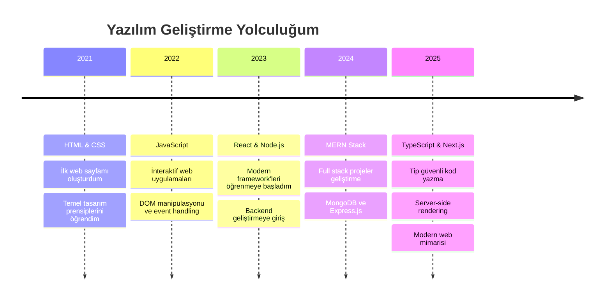

# <div align="center">👋 Merhaba, Ben Berkay!</div>

<div align="center">
  
</div>

<p align="center">
  
  
  
  
</p>

<div align="center">
  <a href="mailto:ofof2467yo@gmail.com">
    
  </a>
  <a href="https://www.instagram.com/s0_be4kay/">
    
  </a>
  <a href="https://discord.com/users/1246506868977696811">
    
  </a>
</div>

---

## 🚀 Hakkımda

```javascript
const berkay = {
  zamir: "o/kendisi",
  yaşadığıYer: "Tokat, Türkiye",
  yaş: 18,
  kod: ["JavaScript", "TypeScript", "HTML", "CSS", "Python"],
  sorabilirsiniz: ["web geliştirme", "teknoloji", "pixel art", "kediler"],
  teknolojiler: {
    frontend: {
      js: ["React", "Next.js", "Vue"],
      css: ["Tailwind", "Bootstrap", "Styled-Components"]
    },
    backend: {
      js: ["Node.js", "Express", "Nest.js"],
      veritabani: ["MongoDB", "PostgreSQL", "Firebase"]
    },
    devOps: ["Docker", "GitHub Actions", "Vercel", "Netlify"],
    araçlar: ["Git", "VS Code", "Figma", "Postman"]
  },
  mimari: ["Serverless Architecture", "Progressive Web Apps", "Single Page Applications"],
  şuandaOdak: "Modern teknoloji yığını ile ölçeklenebilir web uygulamaları geliştirme",
  ilginçBilgi: "Kedim klavyemde uyurken saatlerce kod yazabilirim 🐱"
};
```

### 🎯 Şu an ne yapıyorum:

- 🔭 **Full Stack Web Uygulamaları** üzerinde çalışıyorum
- 🌱 **TypeScript, Next.js ve Docker** öğreniyorum
- 👯 **Açık Kaynak Projelerde** işbirliği yapmak istiyorum
- 💬 **React, Node.js veya Pixel Art** hakkında bana sorabilirsiniz
- ⚡ İlginç gerçek: **Boş zamanlarımda pixel art yapmayı seviyorum**
- 📫 Bana ulaşın: **ofof2467yo@gmail.com**

---

## 🛠️ Teknoloji Yığını

<div align="center">

### Programlama Dilleri


### Frontend Framework'ler ve Kütüphaneler


### Backend ve Veritabanı


### Araçlar ve Platformlar


</div>

---

## 📈 GitHub İstatistikleri

<div align="center">
  
  
</div>

<div align="center">
  
</div>


</div>


<div align="center">
  
### 📊 Haftalık Geliştirme Dağılımı

<!--START_SECTION:waka-->
```text
JavaScript   8 saat 15 dk    ████████████░░░░░░░░░░░░░   48.32%
React        4 saat 2 dk     ██████░░░░░░░░░░░░░░░░░░░   23.67%
CSS          2 saat 30 dk    ███░░░░░░░░░░░░░░░░░░░░░░   14.65%
HTML         1 saat 20 dk    ██░░░░░░░░░░░░░░░░░░░░░░░   07.84%
TypeScript   58 dk           █░░░░░░░░░░░░░░░░░░░░░░░░   05.52%
```
<!--END_SECTION:waka-->

</div>

---

## 🎨 Kod Yazmadığım Zamanlar

<div align="center">
  
🎮 **Oyun Oynama:** RPG ve Strateji Oyunları  
🎨 **Dijital Sanat:** Pixel Art ve UI Tasarım  
📚 **Okuma:** Bilim Kurgu ve Fantastik Romanlar  
🎵 **Müzik:** Kod yazarken Lo-fi ve Synthwave  
🐱 **Kedi Sever:** Kodlama arkadaşım masamda uyur  

</div>

---

## 🌱 Öğrenme Yolculuğum




## 💡  Geliştirici Sözü

<div align="center">
  
*"Kod yazmak, sadece bilgisayara ne yapacağını söylemek değil; gelecekteki kendine ne düşündüğünü açıklamaktır."*

**— John Woods**

</div>

---

## 📚 Şu An Okuduklarım

- 📖 **"Clean Code"** - Robert C. Martin


---

## 🎯 2024 Hedeflerim

- [ ] **TypeScript** ile güçlü tip sistemi öğrenmek
- [ ] **Docker** ve konteynerizasyon teknolojileri
- [ ] **GraphQL** ile API geliştirme
- [ ] **Jest** ve **Cypress** ile test yazmak
- [ ] En az **5 açık kaynak projeye** katkıda bulunmak
- [ ] **Technical writing** becerilerimi geliştirmek
- [x] **React** ekosisteminde uzmanlaşmak ✅
- [x] **Node.js** ile backend geliştirme ✅

---

## 🤝 İşbirliği Yapalım!

<div align="center">
  
İlginç konuşmalar ve işbirliği fırsatlarına her zaman açığım!

**📧 E-posta:** [ofof2467yo@gmail.com](mailto:ofof2467yo@gmail.com)  
**📱 Discord:** [cutieeop](https://discordapp.com/users/1239991183254618277)

</div>

<div align="center">
  
  
</div>

---

<div align="center">
  <b>✨ "Kod, mantık ile yazılmış şiirdir" ✨</b>
  <br><br>
  <i>⭐ Projelerimi beğenirseniz yıldızlamayı unutmayın!</i>
</div>
