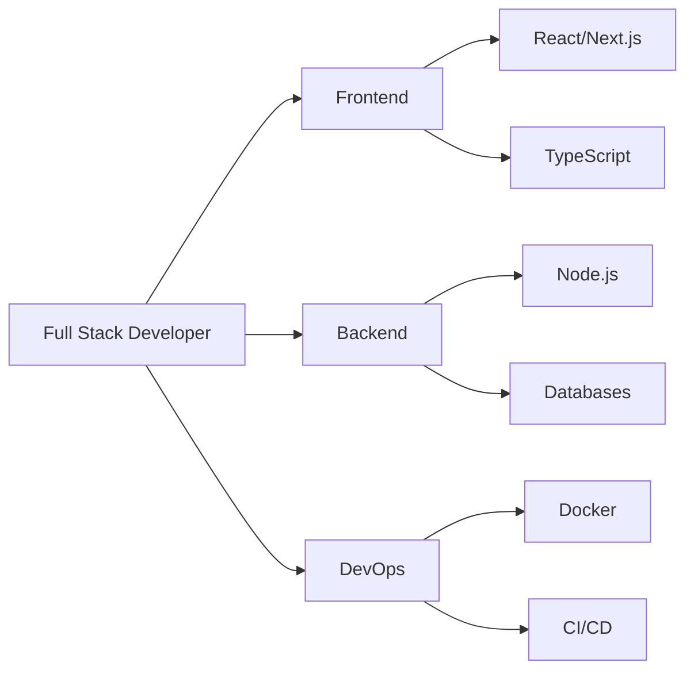

<div align="center">

# 👋 Merhaba, Ben Berkay!


</div>

<div align="center">
  
[](https://github.com/HzKamburga)
[](https://github.com/HzKamburga)
[](https://github.com/HzKamburga)
[](https://github.com/HzKamburga)

</div>

<div align="center">
  
[](mailto:ofof2467yo@gmail.com)
[](https://www.instagram.com/s0_be4kay/)
[](https://discord.com/users/1246506868977696811)
[](https://github.com/HzKamburga)

</div>

<div align="center">
  


</div>

---

## 🚀 Hakkımda

```javascript
const berkay = {
  zamir: "o/kendisi",
  yaşadığıYer: "Tokat, Türkiye",
  yaş: 18,
  eğitim: "Bilgisayar Mühendisliği",
  kod: ["JavaScript", "TypeScript", "HTML", "CSS", "Python"],
  konuşabilirsiniz: ["web geliştirme", "teknoloji", "pixel art", "kediler"],
  
  teknolojiler: {
    frontend: {
      frameworks: ["React", "Next.js", "Vue"],
      styling: ["Tailwind CSS", "Bootstrap", "Styled-Components"],
      state: ["Redux", "Zustand", "Context API"]
    },
    backend: {
      runtime: ["Node.js"],
      frameworks: ["Express", "Nest.js"],
      api: ["REST", "GraphQL"],
      veritabani: ["MongoDB", "PostgreSQL", "Firebase", "Redis"]
    },
    devOps: ["Docker", "GitHub Actions", "CI/CD", "Vercel", "Netlify"],
    araçlar: ["Git", "VS Code", "Figma", "Postman", "Insomnia"],
    testing: ["Jest", "React Testing Library", "Cypress"]
  },
  
  mimari: [
    "Serverless Architecture",
    "Progressive Web Apps",
    "Single Page Applications",
    "Microservices",
    "REST API Design"
  ],
  
  şuandaOdak: "Modern teknoloji yığını ile ölçeklenebilir web uygulamaları geliştirme",
  hedeflerim: [
    "Senior Full Stack Developer olmak",
    "Open Source'a katkıda bulunmak",
    "Kendi SaaS projemi geliştirmek"
  ],
  ilginçBilgi: "Kedim klavyemde uyurken saatlerce kod yazabilirim 🐱",
  
  günlükRutin: function() {
    while (alive) {
      eat();
      code();
      sleep();
      repeat();
    }
  }
};
```

---

## 🎯 Şu an ne yapıyorum?


- 🔭 **Full Stack Web Uygulamaları** üzerinde çalışıyorum
- 🌱 **TypeScript, Next.js 14 ve Docker** öğreniyorum
- 👯 **Açık kaynak projelere** katkıda bulunmak istiyorum
- 🤝 **Web geliştirme** konusunda işbirliğine açığım
- 💬 Bana **JavaScript, React, Node.js** hakkında sorabilirsiniz
- 📫 Bana ulaşın: **ofof2467yo@gmail.com**
- ⚡ **Eğlenceli gerçek:** Pixel art yaparak dinlenmeyi seviyorum!
- 🎯 **2024 Hedefi:** Her gün kod yazmak ve 100+ GitHub katkısı

<br clear="both">

---

## 🛠️ Teknoloji Yığınım

### 💻 Programlama Dilleri
<p align="left">
  
  
  
  
  
  
</p>

### 🎨 Frontend Development
<p align="left">
  
  
  
  
  
  
  
  
</p>

### ⚙️ Backend Development
<p align="left">
  
  
  
  
  
</p>

### 🗄️ Veritabanları
<p align="left">
  
  
  
  
  
</p>

### 🔧 Araçlar & DevOps
<p align="left">
  
  
  
  
  
  
  
  
  
</p>

---

## 📊 GitHub İstatistiklerim

<div align="center">
  
  
</div>

<div align="center">
  
</div>

<div align="center">
  
</div>

---

## 📈 Katkı Grafiği

<div align="center">
  
</div>

---

## 🐍 Katkı Yılanı

<div align="center">
  <picture>
    <source media="(prefers-color-scheme: dark)" srcset="https://raw.githubusercontent.com/HzKamburga/HzKamburga/output/github-contribution-grid-snake-dark.svg">
    <source media="(prefers-color-scheme: light)" srcset="https://raw.githubusercontent.com/HzKamburga/HzKamburga/output/github-contribution-grid-snake.svg">
    
  </picture>
</div>

---

## 💼 Yeteneklerim

<div align="center">

| Kategori | Yetenekler |
|----------|-----------|
| **Frontend** |    |
| **Backend** |    |
| **Database** |    |
| **DevOps** |   |
| **Tools** |    |

</div>

---

## 🏆 GitHub Profil Özeti

<div align="center">
  
</div>

<div align="center">
  
  
  
</div>

---

## 💡 Random Dev Quote

<div align="center">
  
</div>

---

## 🎵 Spotify'da Şu An

<div align="center">
  
</div>

---

## 🎯 Hedeflerim & İlgi Alanlarım



### 📚 Şu an öğreniyorum:
- 🔥 Advanced TypeScript Patterns
- 🚀 Next.js 14 App Router
- 🐳 Docker & Kubernetes
- 📊 System Design & Architecture
- 🔐 Web Security Best Practices

### 🎨 Hobilerim:
- 🎮 Pixel Art Çizimi
- 🎵 Müzik Dinleme
- 📖 Teknoloji Blogları Okuma
- 🐱 Kedimle Vakit Geçirme
- 💻 Side Project Geliştirme

---

## 📫 Benimle İletişime Geçin

<div align="center">

| Platform | Link |
|----------|------|
| 📧 Email | [ofof2467yo@gmail.com](mailto:ofof2467yo@gmail.com) |
| 📷 Instagram | [@s0_be4kay](https://www.instagram.com/s0_be4kay/) |
| 💬 Discord | [HzKamburga](https://discord.com/users/1246506868977696811) |
| 🐙 GitHub | [@HzKamburga](https://github.com/HzKamburga) |

</div>

---

<div align="center">
  
</div>

<div align="center">
  
### ✨ "Kod yazmak bir sanattır, her satır bir fırça darbesidir" ✨

<sub>⭐ Bu profilden hoşlandıysan, yıldız vermeyi unutma!</sub>


</div>
